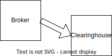

# Implementations

## What would a 300,000 foot view of AAI look like?

## How bout ELIXIR / Life Sciences AAI?

## Which GA4GH driver projects implement AAI and Passports?

As of November 2023, the following driver projects implement AAI / Passports:

- Biomedical Research Hub
- EJP RD
- ELIXIR
- Human Cell Atlas

These driver projects are planning or developing an implementation of AAI / Passports:

- All of Us
- Australian Genomics
- Autism Sharing Initiative
- GDI
- Genomics England
- H3Africa
- ICGC ARGO
- IPCHiP
- Monarch Initiative
- NCI CRDC
- NCPI
- NHLBI BioData Catalyst

[Source](https://docs.google.com/spreadsheets/d/11pPTKVW3j3_WHigWw4UOvlkQbPkM_z-ICgksE5L1vEY)
