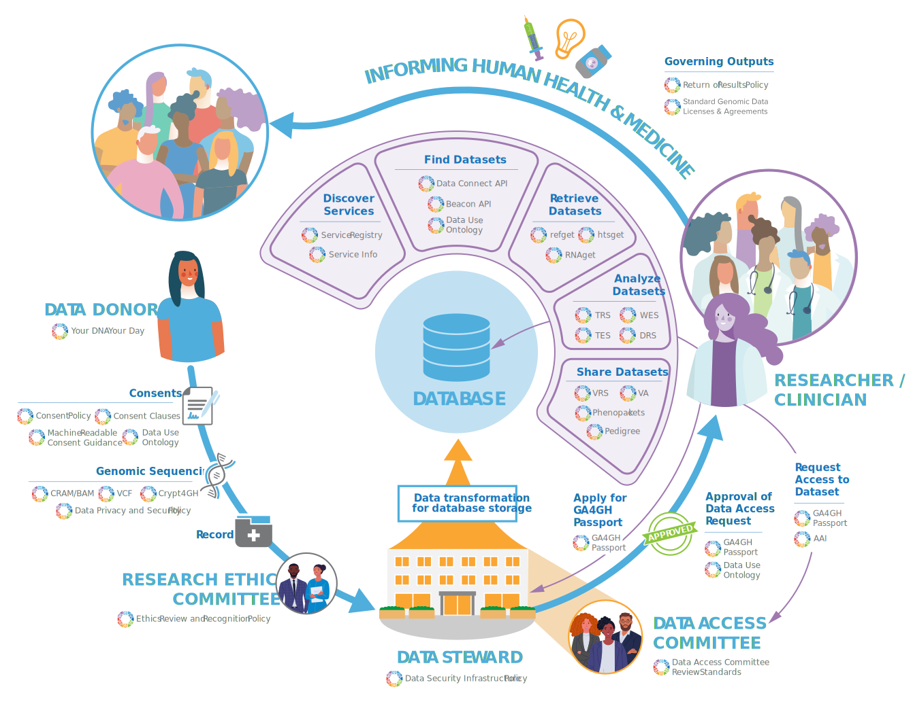

## Authentication and Authorization Infrastructure (AAI)

* [OIDC Profile]()
* [FAQ]()
* [Implementations]()
* [Changes]()

GA4GH AAI and Passports provide secure, standards-based data access in cases where the data access committee / data steward is not tightly coupled with the data holder. 

When the data access approval system, data analysis system, and data repository system are all tightly integrated and are running in the same infrastructure, secure data access is simpler. When the data holder and access authorization systems are operated separately, then it becomes harder to meet two fundamental needs:

* unlock data access for the researcher
* uphold the authority of the data custodian

GA4GH AAI and Passports make it easier to solve both problems by communicating the access grants (authorizations) in a JWT token accessed via OAuth2. This mechanism is easy to implement and secure because it uses standard and secure means including the OIDC, OAuth2, and JWT standards, as well as approved cryptography algorithms.

AAI and Passports minimize risk and cost by:

* reusing existing and familiar libraries and tools
* leveraging existing security regimens
* simplifying compliance and system interconnection approvals
